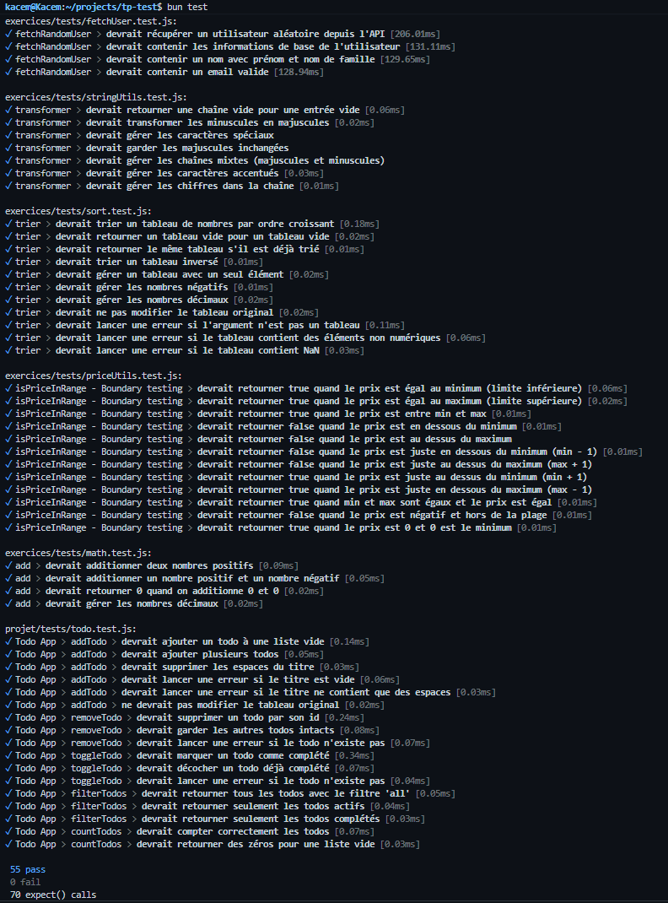
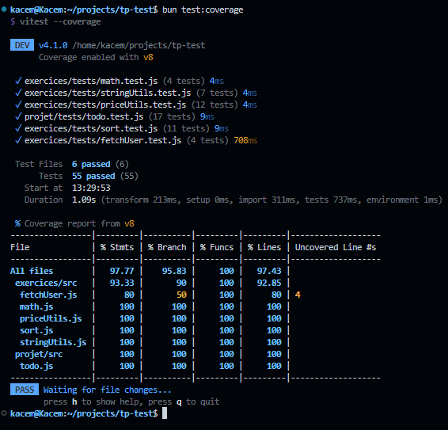

# TP - Tests unitaires avec Vitest

## Structure

```
exercices/          # Exercices du TP
  src/              # Fonctions (math, stringUtils, sort, priceUtils, fetchUser)
  tests/            # Tests unitaires correspondants
projet/             # Mini-projet Todo App
  src/todo.js       # Logique métier
  public/           # Interface web
  tests/            # Tests unitaires
```

## Installation

```bash
bun install
```

## Commandes

```bash
bun run dev             # Lancer le serveur Todo App (http://localhost:3000)
bun run test            # Lancer tous les tests
bun run test:coverage   # Lancer les tests avec couverture de code
```

## Tests



## Couverture de code


